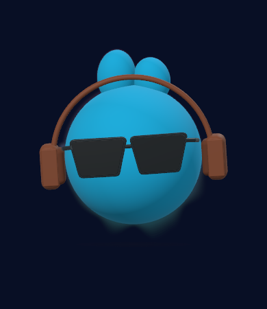
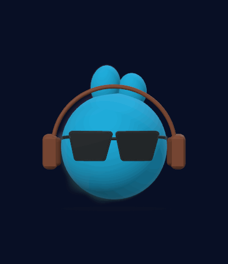

# Miho 迷糊 🎧

一个会随电脑声音动起来的 **3D macOS 桌面精灵**，为 **Tencent Music Hackathon（腾讯音乐黑客松）**制作。

<p>
  
</p>

上图和下方动画统一展示 v0.10.0 的默认蓝色咪虎与贴边频谱柔光。角色可以自定义；已有的紫色或其他搭配会继续保存在各台 Mac 本机，仓库预览不会覆盖你的外观。

v0.10.0 提供**歌手模式／音乐模式**，声音驱动多轴律动，柔光音波直接贴着 3D 角色轮廓。

- **歌手模式**：分离后人声的力度、起音和唱腔带动点头、转肩、侧倾与换重心。真实音节可交替转向，音高升降改变多个轴；长音保持当前目标，强弱继续决定幅度，没有固定舞步时长或伴奏循环。
- **音乐模式**：鼓点和低频决定主要力度，BeatNet 跟踪的节拍驱动连续点头、身体弹动和较慢的换重心；重拍加力，轻碎高频不会独立触发全身冲击。无人声的背景音乐也能驱动。
- **声音大，动作大**：声音增强时整体放大，弹跳、点头和转动增加；减弱时平滑收小，配饰一起变化。采用固定音量参考，避免弱声音也获得相同力度。
- **贴边柔光音波**：由实际身体、耳朵、耳机等网格生成多层淡出轮廓，跟随外观与鼠标旋转；不是悬在角色外面的圆圈。24 段实际频谱控制不同方向的局部外扩，低频和重音形成较大的波峰，高频形成细波。歌手模式用人声频谱，音乐模式用系统混合声音频谱；桌面保持透明。
- **切换模式**：右键角色或菜单栏选择「歌手模式／音乐模式」，「舞步预览」也提供分段选择。选择保存于本机，切换不重启捕获、不重置外观或桌面位置，姿态保持平滑衔接。
- **鼠标互动**：直接拖动旋转，左右可转整圈，上下轻轻俯仰；松手保留角度并带少量惯性。双击回正，可从菜单开启自动回正。按住 **⌥ Option 拖动**移动桌面位置。
- **自定义角色**：名字、圆球／豆豆／圆方、耳朵、眼睛、眼镜、配饰、独立颜色和柔软／光泽材质。修改立即同步，保存在本机。
- **舞步预览**：与桌面共享同一份真实音频和姿态，显示当前模式、声音能量与音波强度，提供动作幅度调节与暂停。没有额外的演示节拍或舞步选择器。

默认咪虎由原生 3D 几何绘制：三轴半径相同的蓝色球体、短耳、棕色耳机、黑色墨镜。音量放大使用整体等比缩放，镜头为耳机和动作预留空间。平滑材质、96 分段球体与桌面 8× MSAA 避免细绒毛网格产生的边缘噪点。你的角色搭配、旋转与幅度设置会保留。

| 歌手模式 | 音乐模式 |
| --- | --- |
|  |  |
| 分离后的人声力度、起音与可靠音高驱动多轴姿态；柔光使用人声频谱。 | 鼓声、低频与 BeatNet 节拍驱动律动；柔光使用混合系统声音频谱。 |

两种模式使用同一角色外观，切换只改变声音驱动方式。GIF 使用本项目的**大小声短音节、变化音量的长音与独立鼓声**，经过同一特征分析、姿态引擎、贴边音波和 3D 场景绘制；音乐模式还经过实际 BeatNet。该离线演示直接提供各声部，绕过人声分离模型；它不代表真实歌曲的分离质量或跟随准确率，也没有现场播放器音轨。

## 打开与使用

需要 **Apple Silicon Mac、macOS 14.2 或更新版本**。构建需要 Xcode 与 Swift 5.10 或更新版本。

```bash
./scripts/build-app.sh
open dist/Miho.app
```

第一次构建会从上游下载固定版本的本机人声模型和 ONNX Runtime SDK（约 70 MB）；约 1.6 MB 的固定节拍模型随仓库提供。下载后核对 SHA-256。后续构建复用 `Vendor/` 缓存。模型和原生运行库会打包进 `.app`；运行时无需联网、Python、服务器或 API 密钥。当前下载脚本只支持 Apple Silicon。

脚本优先使用 `/Applications/Xcode.app`，不改变全局 `xcode-select`；其他 Xcode 路径可通过 `DEVELOPER_DIR` 指定。应用位于 `dist/Miho.app`，构建产物不提交 Git。

1. 首次打开点击「开始听音乐」，允许系统音频捕获。
2. 在音乐软件、Chrome 或其他应用播放声音，歌手模式跟随人声，音乐模式跟随鼓点与背景音乐。多个应用同时播放时，分析混合系统输出。
3. 直接拖动咪虎旋转；**⌥ Option 拖动**移动位置；**双击**回正。
4. 点击菜单栏笑脸或右键角色，暂停、隐藏、调节灵敏度或退出。
5. 「**自定义角色…**」修改搭配；向下滚动可看到全部配饰。
6. 从右键／菜单栏或「**舞步预览…**」选择**歌手模式／音乐模式**，使用「动作幅度」调节力度。

外观分类参照公开的 [Dots 官方说明](https://learn.chatgpt.com/docs/dots)。官方未提供完整款式目录和 3D 素材，本项目的款式自行绘制，不调用 DALL·E。

桌面窗口为 280 × 300 点，透明、无 Dock 图标、不抢键盘焦点。桌面位置自动保存，显示器变化后限制在可用屏幕内。

构建期间要保留正在运行的旧实例，可以先生成独立的新应用，验证后再替换：

```bash
MIHO_APP_PATH="$PWD/dist/staged/Miho.app" ./scripts/build-app.sh
```

## 音频权限与隐私

使用 Apple **Core Audio Process Tap** 捕获立体声系统输出，保持正常播放。Tap-only 聚合设备不包含硬件麦克风；不请求麦克风权限，不录屏。声音只在本机的短暂内存缓冲中分析，不保存、不上传。

权限入口：系统设置 → 隐私与安全性 → **屏幕与系统音频录制** → **仅系统音频录制** → Miho。不同 macOS 版本名称可能不同。

没有授权或输入失败时，角色仍可显示和旋转。播放了声音却没反应，检查权限，然后选择「重试音频连接」。输出设备变化与唤醒会合并后重连；暂停期间不会自动恢复捕获。本地临时签名在重新构建后可能需要重新授权。跨电脑分发签名和公证留待后续。

## 实现与研究

数据流：**系统立体声 → 有界后台队列 → 分析重采样 → 人声分离 → 人声包络／重音／延音／音高 → 连续姿态 → 3D 角色**。歌手模式使用人声特征；音乐模式使用 BeatNet、鼓声与低频特征。频谱驱动贴边柔光。

- `LearnedBeatAnalysis` / `BeatClock`：固定的 BeatNet 模型，20 ms 一跳，过去的 64 ms 音频窗；8 秒标量历史支持节奏估计，不是声音延迟缓冲。自写因果周期／相位解码器，非上游粒子滤波器；音乐模式使用跟踪到的拍子，歌手模式不使用伴奏拍子。
- `CStemSeparator`：自写原生 C++ 宿主，运行 [StemgenRT-5.8](https://github.com/sweetspotsoundsystem/StemgenRT-5.8) 的固定流式模型。128 样本一跳，保留八份递归状态，首跳预热；使用 [ONNX Runtime](https://github.com/microsoft/onnxruntime) CPU SDK。
- `SeparatedAudioAnalysis`：保存立体声的分析重采样、独立工作线程、最多约 60 ms 的待处理音频；全频段人声包络以约 25 ms 起、100 ms 落的时间常数平滑。积压时丢弃旧数据并重置状态，停用后不发布旧结果；音频回调不等待模型。模型损坏或分离失败会显示错误，不偷偷退回“混音当人声”。
- `RhythmAnalyzer`：512 样本音量与三频段分析、Hann FFT、谱能量上升、自适应瞬态阈值。同一次 FFT 生成 24 段绝对音量频谱，不增加第二套 FFT 或音频捕获。生产环境鼓点来自分离后的鼓声及少量低音。
- `VocalExpressionAnalyzer`：在**分离后的人声**上分析约 43 ms 的短窗、周期性、延音和音高；参考 [YIN 原论文](https://pubmed.ncbi.nlm.nih.gov/12002874/)。重新起音会重置延音计时；噪声性唱句可以跟随力度，可靠的周期性才驱动音高轴。
- `Choreographer`：根据当前模式选择人声多轴动作或鼓点／低频律动；持续信号保持目标，起音短促加力，所有轴经过受限惯性。
- `SoundField` / `AudioReactiveHalo`：按模式选择 24 段实际频谱，复用同一画面状态；SceneKit 在真实网格外生成八层高斯递减透明度的轮廓，Metal shader 按视角位置映射频段、沿法线局部外扩，并按视角羽化边缘。原角色覆盖内部区域，保留贴着实际轮廓的柔光；模型姿态、外观和旋转变化时同步。实现参考 [Apple SCNShadable](https://developer.apple.com/documentation/scenekit/scnshadable)。
- `DragRotation`、`CharacterAppearance`、`CharacterScene`：独立鼠标旋转、持久化外观、持久化 SceneKit 几何与材质。

研究过流式拍点跟踪与音乐生成舞蹈，实际接入 BeatNet 与源分离模型，并参考人体节律研究设计球形角色的动作。对比与来源见 [docs/MUSIC_FOLLOWING.md](docs/MUSIC_FOLLOWING.md)。依赖版本、校验和与 MIT／CC BY 4.0 许可见 [ThirdParty/README.md](ThirdParty/README.md)。

实时波形方案参考 [DSWaveformImage 的实时波形和绝对音量说明](https://github.com/dmrschmidt/DSWaveformImage)，频谱绘制参考 [Apple Accelerate 示例](https://developer.apple.com/documentation/accelerate/visualizing-sound-as-an-audio-spectrogram)。本项目用已有系统输出与分离声部、自有 SceneKit shader 绘制，不引入示例里的麦克风捕获。

## 开发与验证

```bash
./scripts/test.sh
./scripts/build-app.sh
# 调试构建
CONFIGURATION=debug ./scripts/build-app.sh
```

环境有疑问时先运行 `./scripts/doctor.sh`。它只检查本机工具和依赖文件，不下载、不构建、不修改系统设置；文件存在不等于校验和或运行验证通过。缺少完整 Xcode 时，测试脚本会在下载模型之前给出 XCTest 安装提示。

开发脚本的离线回归不依赖 Xcode，可运行 `python3 scripts/test-developer-tools.py`。覆盖下载中断、校验失败、完整／损坏 SDK、测试前置检查和带空格的输出路径；它不替代音频、场景或 XCTest 验证。模型下载有连接与总时限，校验失败保留旧模型；SDK 在临时目录解压和验证后再替换缓存。自定义 `MIHO_APP_PATH` 必须以 `.app` 结尾，相对路径以仓库根目录为基准。

先退出旧 Miho 再启动新构建。诊断只输出标量，不保存音频：

```bash
# 十秒捕获诊断（会退出）
./dist/Miho.app/Contents/MacOS/Miho --probe
# 打开实时预览，输出六十秒音高／姿态统计（应用继续运行）
./dist/Miho.app/Contents/MacOS/Miho --dance-studio --trace-motion
# 分析明确提供的本地测试文件，只输出标量，不播放或录制
./dist/Miho.app/Contents/MacOS/Miho --analyze-file /path/to/test.wav
# 角色编辑器 / 连接状态
./dist/Miho.app/Contents/MacOS/Miho --character-editor
./dist/Miho.app/Contents/MacOS/Miho --diagnostics
# 导出同一场景的图标与合成唱句预览，不启动声音捕获
./dist/Miho.app/Contents/MacOS/Miho --export-artifacts dist/artwork
./dist/Miho.app/Contents/MacOS/Miho --export-motion dist/artwork/miho-dance-preview.gif
# 音乐模式的合成伴奏预览
./dist/Miho.app/Contents/MacOS/Miho --export-motion dist/artwork/miho-music-preview.gif --music-mode
```

自动测试覆盖模型宿主与上游 Python 结果的一致性、状态重置、重采样、队列积压与取消，以及大小声驱动大小动作、长音渐弱、歌手模式不受强鼓点改变、音乐模式支持无人声的伴奏、连续增强的人声继续抬起、整个人物连同配饰放大、频谱反映实际频率与强弱、音波暂停、模式持久化与平滑切换、真实 GPU 轮廓的贴合／频段差别／转动、88／124／174 BPM 跟踪与音乐模式点头、惯性、同音高反复音节、音高升降、静音、权限失败、设备重连和鼠标旋转。实体测试与证据边界见 [docs/VALIDATION.md](docs/VALIDATION.md)。

## 换一台 Mac 接续开发

先确认当前分支、提交和未提交内容，再建立独立的本地目录：

```bash
git status --short --branch
git log -1 --oneline
git remote -v
```

保留原目录；有未提交修改时，连同源码一起迁移，不能只克隆远端。完整复制 Git 历史后，本地目录可以使用不同名称，不影响 `Miho` 包名或 GitHub remote。不要复用另一台机器的 `.build/`；`Vendor/` 的已校验模型与原生库可复用，避免重复下载。角色外观、幅度和音频权限保存在各台 Mac 本机，需要分别确认。

只有 Command Line Tools 时，应用本体可能可以编译，但 XCTest 需要完整 Xcode。出现 `no such module 'XCTest'` 时，先安装完整 Xcode，再使用 `scripts/test.sh`；脚本会优先选择 `/Applications/Xcode.app`，无需修改全局 `xcode-select`。具体迁移与构建证据见 [验证记录](docs/VALIDATION.md)。

## 常见问题

- **为什么我的角色和 README 颜色不同？** README 展示默认蓝色咪虎，应用使用本机保存的自定义搭配。右键角色选择「自定义角色…」可查看和修改；换一台电脑后搭配不会通过 Git 自动同步。
- **播放音乐后没有动作？** 先确认没有暂停，检查「仅系统音频录制」权限，再选择「重试音频连接」。没有人声的伴奏请切到音乐模式；歌手模式主要跟随分离后的人声。
- **两种模式的音波有什么区别？** 两种模式都贴着同一个 3D 角色轮廓，歌手模式用人声频谱，音乐模式用混合系统声音频谱。README 的 GIF 是离线合成演示，真实歌曲仍需试听。
- **只有 Command Line Tools 能跑测试吗？** 当前笔记本的 Release 应用本体可以编译，但测试目标缺少 XCTest。安装完整 Xcode 后再运行 `./scripts/test.sh -c release`；编译通过不等于本机音频权限与设备验证通过。

## 当前限制

人声分离是估计结果，伴奏、和声和混响仍可能泄漏；嘶哑、气声、多人同时唱或强音效会降低音高可靠性。歌手模式可能误跟分离模型漏入的伴奏；音乐模式的节拍可能失锁或采用半速／倍速解释。不做歌词理解、歌手身份识别或人体编舞预测，不承诺每首歌每一句都准确。

目标响应低于 150 ms。诊断测量音频时间戳到姿态状态，**不包含 SceneKit 插值、屏幕扫描或完整听觉到画面延迟**；后台负载和主线程卡顿仍可能引起峰值。原生模型推理也会持续使用 CPU。

暂停播放约一秒回到待机。系统静音可能仍提供应用音频，想让咪虎休息可暂停律动。受系统或内容保护限制的声音不保证兼容；更多设备组合仍待测试。第一版聚焦 macOS、一个角色和实时音乐律动，不含手机灵动岛、角色商店或 AI 编舞。
