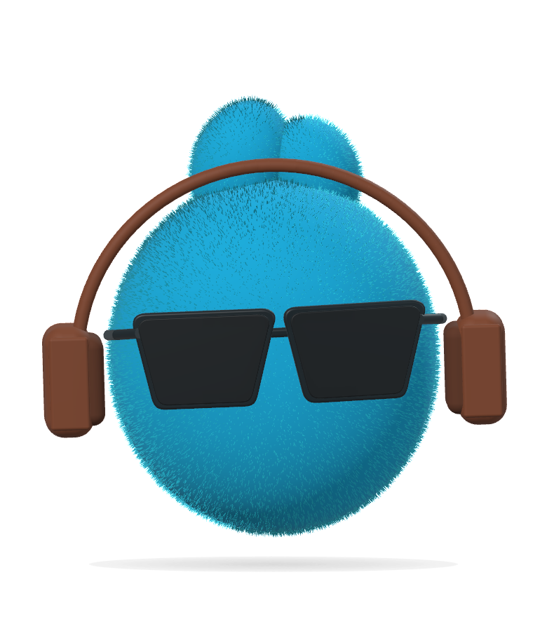
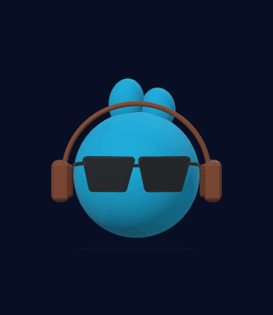
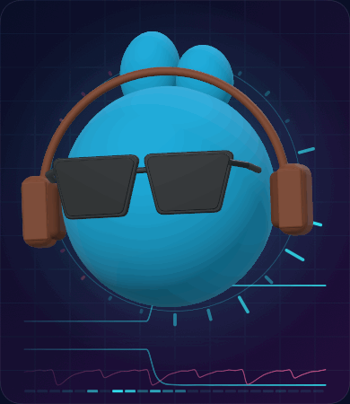

# Miho 迷糊 🎧

一个会随电脑声音动起来的 **3D macOS 桌面精灵**，为 **Tencent Music Hackathon（腾讯音乐黑客松）**制作。

<p>
  
  
</p>

v0.8.0 将**人声强弱直接映射到身体大小和动作幅度**，鼓点适度叠加力度，并加入实时彩色音波背景。

- **声音大，动作大**：人声变强时，角色连同耳机、墨镜整体放大，弹跳和俯仰幅度增加；人声变轻时随之收小。采用固定音量参考，不把每段小声音都归一化成同样大的动作。
- **唱腔延展**：可靠的音高上扬带动抬起，真正的长音保持舒展方向，当前音量继续决定幅度；不再保留整句前面的音量峰值。收句后平滑放松，反复音节会重新计时。
- **人声＋鼓点**：人声决定主要幅度，鼓点叠加有限的弹跳力度。延音和换气期间减轻鼓点，伴奏拍子不另起身体循环，避免把人声姿态带跑。
- **彩色音波背景**：桌面和预览共享网格、频谱光环和流线。青色是最近约 3.2 秒的人声音量包络，粉色是鼓声音量包络；光环和底部色块来自实际 24 段 FFT 频谱，光晕亮度跟随同一动作驱动值。没有随机假频谱或固定节奏动画。
- **伴奏补充**：没有人声时，BeatNet 节拍跟踪支持较小的点头和摆身。最终姿态限制速度和加速度，没有按时间轮换的舞步片段。
- **鼠标互动**：直接拖动旋转，左右可转整圈，上下轻轻俯仰；松手保留角度并带少量惯性。双击回正，可从菜单开启自动回正。按住 **⌥ Option 拖动**移动桌面位置。
- **自定义角色**：名字、圆球／豆豆／圆方、耳朵、眼睛、眼镜、配饰、独立颜色和柔软／光泽材质。修改立即同步，保存在本机。
- **舞步预览**：与桌面共享同一份真实音频和姿态，显示「人声领舞」、人声、延音和鼓点，提供动作幅度调节与暂停。没有额外的演示节拍或舞步选择器。

默认咪虎由原生 3D 几何绘制：三轴半径相同的蓝色球体、短耳、棕色耳机、黑色墨镜。音量放大使用整体等比缩放，镜头为耳机和动作预留空间。平滑材质、96 分段球体与桌面 8× MSAA 避免细绒毛网格产生的边缘噪点。你的角色搭配、旋转与幅度设置会保留。





GIF 使用本项目的**大小声短音节、变化音量的长音与独立鼓声**，经过同一人声特征分析、姿态引擎、音波背景和 3D 场景绘制。该离线演示直接提供各声部，绕过人声分离模型；它不代表真实歌曲的分离质量或跟随准确率，也没有现场播放器音轨。

## 打开与使用

需要 **Apple Silicon Mac、macOS 14.2 或更新版本**。构建需要 Xcode 与 Swift 5.10 或更新版本。

```bash
./scripts/build-app.sh
open dist/Miho.app
```

第一次构建会从上游下载固定版本的本机人声模型和 ONNX Runtime SDK（约 70 MB）；约 1.6 MB 的固定节拍模型随仓库提供。下载后核对 SHA-256。后续构建复用 `Vendor/` 缓存。模型和原生运行库会打包进 `.app`；运行时无需联网、Python、服务器或 API 密钥。当前下载脚本只支持 Apple Silicon。

脚本优先使用 `/Applications/Xcode.app`，不改变全局 `xcode-select`；其他 Xcode 路径可通过 `DEVELOPER_DIR` 指定。应用位于 `dist/Miho.app`，构建产物不提交 Git。

1. 首次打开点击「开始听音乐」，允许系统音频捕获。
2. 在音乐软件、Chrome 或其他应用播放声音，人声出现后驱动动作。无人声的伴奏需要数秒建立拍子。多个应用同时播放时，分析混合系统输出。
3. 直接拖动咪虎旋转；**⌥ Option 拖动**移动位置；**双击**回正。
4. 点击菜单栏笑脸或右键角色，暂停、隐藏、调节灵敏度或退出。
5. 「**自定义角色…**」修改搭配；向下滚动可看到全部配饰。
6. 「**舞步预览…**」查看人声、延音与实时动作，使用「动作幅度」调节力度。

外观分类参照公开的 [Dots 官方说明](https://learn.chatgpt.com/docs/dots)。官方未提供完整款式目录和 3D 素材，本项目的款式自行绘制，不调用 DALL·E。

桌面窗口为 220 × 260 点，透明、无 Dock 图标、不抢键盘焦点。桌面位置自动保存，显示器变化后限制在可用屏幕内。

构建期间要保留正在运行的旧实例，可以先生成独立的新应用，验证后再替换：

```bash
MIHO_APP_PATH="$PWD/dist/staged/Miho.app" ./scripts/build-app.sh
```

## 音频权限与隐私

使用 Apple **Core Audio Process Tap** 捕获立体声系统输出，保持正常播放。Tap-only 聚合设备不包含硬件麦克风；不请求麦克风权限，不录屏。声音只在本机的短暂内存缓冲中分析，不保存、不上传。

权限入口：系统设置 → 隐私与安全性 → **屏幕与系统音频录制** → **仅系统音频录制** → Miho。不同 macOS 版本名称可能不同。

没有授权或输入失败时，角色仍可显示和旋转。播放了声音却没反应，检查权限，然后选择「重试音频连接」。输出设备变化与唤醒会合并后重连；暂停期间不会自动恢复捕获。本地临时签名在重新构建后可能需要重新授权。跨电脑分发签名和公证留待后续。

## 实现与研究

数据流：**系统立体声 → 有界后台队列 → 分析重采样 → 人声分离 → 人声包络／重音／延音／音高 → 连续姿态 → 3D 角色**。独立的 BeatNet 拍子与鼓声特征用于伴奏补充。

- `LearnedBeatAnalysis` / `BeatClock`：固定的 BeatNet 模型，20 ms 一跳，过去的 64 ms 音频窗；8 秒标量历史支持节奏估计，不是声音延迟缓冲。自写因果周期／相位解码器，非上游粒子滤波器；拍子只主导无人声时的伴奏动作。
- `CStemSeparator`：自写原生 C++ 宿主，运行 [StemgenRT-5.8](https://github.com/sweetspotsoundsystem/StemgenRT-5.8) 的固定流式模型。128 样本一跳，保留八份递归状态，首跳预热；使用 [ONNX Runtime](https://github.com/microsoft/onnxruntime) CPU SDK。
- `SeparatedAudioAnalysis`：保存立体声的分析重采样、独立工作线程、最多约 60 ms 的待处理音频；全频段人声包络以约 25 ms 起、100 ms 落的时间常数平滑。积压时丢弃旧数据并重置状态，停用后不发布旧结果；音频回调不等待模型。模型损坏或分离失败会显示错误，不偷偷退回“混音当人声”。
- `RhythmAnalyzer`：512 样本音量与三频段分析、Hann FFT、谱能量上升、自适应瞬态阈值。同一次 FFT 生成 24 段绝对音量频谱，不增加第二套 FFT 或音频捕获。生产环境鼓点来自分离后的鼓声及少量低音。
- `VocalExpressionAnalyzer`：在**分离后的人声**上分析约 43 ms 的短窗、周期性、延音和音高；参考 [YIN 原论文](https://pubmed.ncbi.nlm.nih.gov/12002874/)。重新起音会重置延音计时；噪声性唱句可以跟随力度，可靠的周期性才驱动音高轴。
- `Choreographer`：人声包络与唱腔决定主要姿态，人声强弱控制全角色等比缩放和动作幅度，当前音量不受历史峰值钳制。鼓点有限加力，所有轴经过受限惯性。
- `SoundField` / `AudioReactiveField`：只保存有界标量历史和 FFT 频谱，复用同一 60 Hz 画面状态；SwiftUI Canvas 绘制网格、频谱光环、流线和色块。暂停后停止新声波，历史尾迹逐渐离开画面。
- `DragRotation`、`CharacterAppearance`、`CharacterScene`：独立鼠标旋转、持久化外观、持久化 SceneKit 几何与材质。

研究过流式拍点跟踪与音乐生成舞蹈，实际接入 BeatNet 与源分离模型，并参考人体节律研究设计球形角色的动作。对比与来源见 [docs/MUSIC_FOLLOWING.md](docs/MUSIC_FOLLOWING.md)。依赖版本、校验和与 MIT／CC BY 4.0 许可见 [ThirdParty/README.md](ThirdParty/README.md)。

实时波形方案参考 [DSWaveformImage 的实时波形和绝对音量说明](https://github.com/dmrschmidt/DSWaveformImage)，频谱绘制参考 [Apple Accelerate 示例](https://developer.apple.com/documentation/accelerate/visualizing-sound-as-an-audio-spectrogram)。本项目用已有系统输出与分离声部、自有 Canvas 绘制，不引入示例里的麦克风捕获。

## 开发与验证

```bash
./scripts/test.sh
./scripts/build-app.sh
# 调试构建
CONFIGURATION=debug ./scripts/build-app.sh
```

先退出旧 Miho 再启动新构建。诊断只输出标量，不保存音频：

```bash
# 十秒捕获诊断（会退出）
./dist/Miho.app/Contents/MacOS/Miho --probe
# 打开实时预览，输出六十秒音高／姿态统计（应用继续运行）
./dist/Miho.app/Contents/MacOS/Miho --dance-studio --trace-motion
# 分析明确提供的本地测试文件，只输出标量，不播放或录制
./dist/Miho.app/Contents/MacOS/Miho --analyze-file /path/to/test.wav
# 角色编辑器 / 连接状态
./dist/Miho.app/Contents/MacOS/Miho --character-editor
./dist/Miho.app/Contents/MacOS/Miho --diagnostics
# 导出同一场景的图标与合成唱句预览，不启动声音捕获
./dist/Miho.app/Contents/MacOS/Miho --export-artifacts dist/artwork
./dist/Miho.app/Contents/MacOS/Miho --export-motion dist/artwork/miho-dance-preview.gif
```

自动测试覆盖模型宿主与上游 Python 结果的一致性、状态重置、重采样、队列积压与取消，以及大小声驱动大小动作、长音渐弱、鼓点有限叠加、整个人物连同配饰放大、频谱反映实际频率与强弱、音波历史／暂停、88／124／174 BPM 跟踪、惯性、同音高反复音节、音高升降、静音、权限失败、设备重连和鼠标旋转。实体测试与证据边界见 [docs/VALIDATION.md](docs/VALIDATION.md)。

## 当前限制

人声分离是估计结果，伴奏、和声和混响仍可能泄漏；嘶哑、气声、多人同时唱或强音效会降低音高可靠性。节拍跟踪可能错拍、采用半速／倍速解释，或在复杂切分和多首歌曲同时播放时失锁；重新建立拍子需要数秒。当前估计范围为 55–215 BPM，不做歌词理解、歌手身份识别或人体编舞预测，不承诺每首歌每一句都准确。

目标响应低于 150 ms。诊断测量音频时间戳到姿态状态，**不包含 SceneKit 插值、屏幕扫描或完整听觉到画面延迟**；后台负载和主线程卡顿仍可能引起峰值。原生模型推理也会持续使用 CPU。

暂停播放约一秒回到待机。系统静音可能仍提供应用音频，想让咪虎休息可暂停律动。受系统或内容保护限制的声音不保证兼容；更多设备组合仍待测试。第一版聚焦 macOS、一个角色和实时音乐律动，不含手机灵动岛、角色商店或 AI 编舞。
